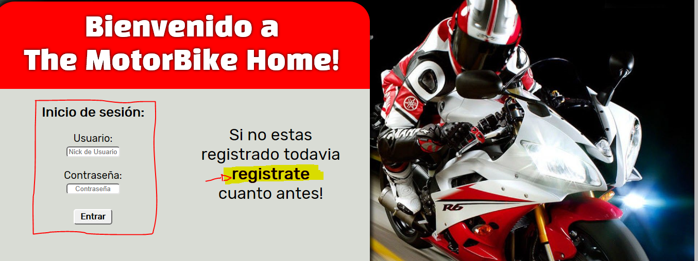
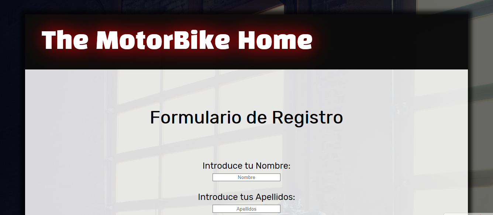
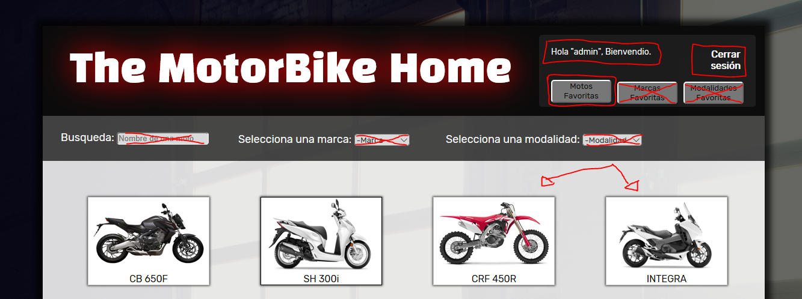
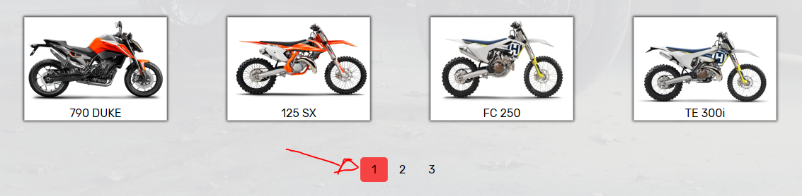
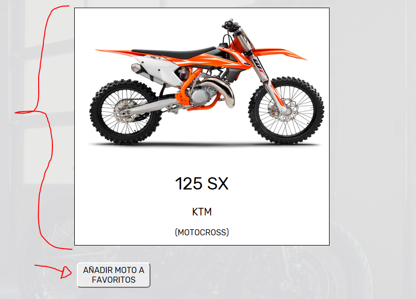
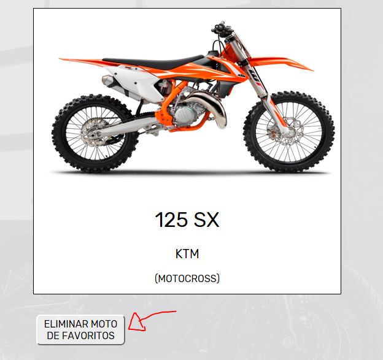
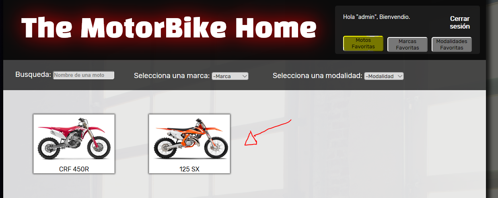

# Proyecto_PHP_DAW2
Proyecto en php realizado para la asignatura de Desarrollo Web Entorno Servidor del curso 2º DAW

## INDEX

En el *"Index.php"* encontraras, por un lado, un enlace a la pestaña de registro, y por otro la un formulario de logueo *"NECESARIO"*
para entrar al sitio web. Si te logueas incorrectamente aparecera un mensaje de error en el logueo debido a un usuario 
o contraseña incorrectos.

## REGISTRO

En el formulario de registro encontraras unos campos, los cuales todos son obligatorios de rellenar, y el nombre de usuario es uncio,
es decir, que si el nombre de usuario ya existe en la base de datos tendras que poner otro y aparecera un mensaje avisandote de esto.
Si te registras correctamente te redirigira al index para que procedas con el registro.

## MAIN

En el *"main.php"* encontraras una galeria con todos los productos que hay, los cuales tienen una paginacion que te indica
en que pagina te encuentras. Ademas si seleccionas alguno de los productos podras añadirlo a tu lista de favoritos. 
tambien en la parte superior izquierda de la web veras un mensaje de bienvenida ademas de la posibilidad de cerrar la sesion.
y en esa zona tambien hay botones para acceder a la lista de los productos que tu hallas añadido a favoritos.

## MOTO SELECCIONADA

Una vez que hayas seleccionado una moto en la pestaña anterior te aparecera esta con una foto mas grande de la moto que has seleccionado,
junto con su nombre, la marca, y la modalidad de dicho producto. ademas justo debajo de esto aparecera un boton para poder añadir 
tu moto a favoritos, o eliminarlo, segun se de la situacion, el boton ademas de ser dinamico, cambia al instante su estado sin 
necesitar refrescar la web.

## GALERIA MOTOS FAVORITAS

Si entras en la lista de tus productos favoritos veras una galeria similar a la que encontraste en el *"main.php"* solo que 
con los productos que elegiste en favoritos y si haces click en ellos tendra el mismo efecto que si hacias click 
sobre ellos en el *"main.php"*

## NOTAS Y COSAS A MEJORAR

1- Los botones de marcas y modalidades favoritas no estan implementados.

2- La busqueda y selectores en el main todavia no estan implementados.

3-La navegación en la web no esta muy bien planteada, ya que no tiene botones para retroceder a la galeria, etc...

4-Para la proxima entrega esta pendiente introducir un modo administrador.
